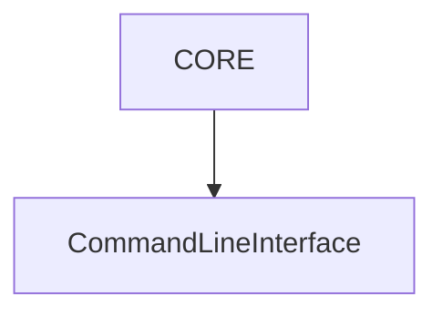

[](https://github.com/asienicki/slnx-mermaid/actions/workflows/ci.yml)

# 🧜 slnx-mermaid

Generate Mermaid dependency diagrams from .NET solution files (`.slnx`, `.sln`).

`slnx-mermaid` is a CLI tool designed for architecture-as-code workflows. 

It analyzes your solution structure and produces deterministic Mermaid diagrams that can be committed to your repository or generated in CI/CD pipelines.

---

## Features

* YAML-based configuration
* Supports `.slnx` and `.sln` solution files
* Deterministic output
* `{date}` placeholder support in file names
* CI/CD friendly
* Architecture documentation always in sync with code

---

## Installation

Install globally as a .NET tool:

```bash
dotnet tool install --global slnx-mermaid
```

Verify installation:

```bash
dotnet tool search slnx-mermaid
```

---

## Quick Start

1. Create a configuration file named `slnx-mermaid.yml` in your solution directory and ensure the settings correctly target your project structure.
2. Open a console in your solution directory:
```bash
cd X:\Source\slnx-mermaid
```
3. Run:

```bash
slnx-mermaid
```
4. The Mermaid diagram will be generated according to your configuration.

---

## Configuration Example

```yaml
solution: SlnxMermaid.slnx

diagram:
  direction: TD   # TD (top-down) | LR (left-right)

filters:
  exclude:
    - Tests
    - Dto
    - Enums
    - AppHost
    - ServiceDefaults
    - Seeder

naming:
  stripPrefix: SlnxMermaid_
  aliases:
    Core: CORE
    CLI: Command Line Interface

output:
  file: docs\architecture\{date}-dependency-graph-mermaid.md
```
## Why exclude certain projects?

In many solutions, not all projects represent architectural building blocks.

Common exclusions:

- `Tests` – test projects usually do not represent production dependencies.
- `Dto`, `Enums` – often shared model-only projects that would clutter the diagram.
- `AppHost`, `ServiceDefaults`, `Seeder` – infrastructure or bootstrap projects.

Filtering keeps the diagram focused on architectural boundaries instead of technical noise.

## Naming Strategy

### StripPrefix
Large solutions often prefix all projects with the solution name:

SlnxMermaid.Core  
SlnxMermaid.CLI  
SlnxMermaid.Infrastructure  

While useful in code, this prefix adds visual noise in diagrams.

The `stripPrefix` option removes redundant text so the diagram focuses on
meaningful architectural elements instead of repeated solution names.

Example:

Before:
SlnxMermaid.Core --> SlnxMermaid.CLI

After:
Core --> CLI

Cleaner diagrams improve readability and architectural reasoning.

### Aliases

Project names are not always ideal for documentation.

Sometimes:

- Internal names are too technical.
- Abbreviations are unclear.
- You want a more descriptive label for readers.

The `aliases` section lets you map internal project names to
documentation-friendly labels.

Example:

Core --> CORE  
CLI  --> Command Line Interface  

This improves clarity for non-developer stakeholders
while keeping the actual project structure unchanged.

---

## Output

Example generated file:

```
docs/architecture/2026-02-12 17_17_59-dependency-graph-mermaid.md
```

Example Mermaid content:



---

## Optional Placeholders

| Placeholder | Description                                                                    |
| ----------- | ------------------------------------------------------------------------------ |
| `{date}`    | Current timestamp (normalized for file systems in format: yyyy-MM-dd HH_mm_ss) |

---

## Typical Workflow

1. Add `slnx-mermaid.yml` to your repository.
2. Commit the configuration.
3. Run in CI/CD:

```bash
slnx-mermaid
```

4. Commit generated diagrams or publish them as build artifacts.

This ensures your architecture documentation evolves with your codebase.

---

## Use Cases

* Visualizing project dependencies
* Enforcing architectural boundaries
* Generating documentation automatically
* Keeping diagrams version-controlled

---

## Requirements

* .NET SDK (compatible with .NET tool installation)

---

## Path Resolution

`slnx-mermaid` supports both **relative and absolute paths** for:

* `solution`
* `output.file`

Relative paths are resolved from the directory where the configuration file (`slnx-mermaid.yml`) is located.

### Relative path examples

Configuration file located in repository root:

```yaml
solution: src/SlnxMermaid.slnx
```

Solution file located in the parent directory:

```yaml
solution: ../SlnxMermaid.slnx
```

Output file using relative path:

```yaml
output:
  file: docs/architecture/diagram.md
```

### Absolute path examples

```yaml
solution: C:/Source/SlnxMermaid/SlnxMermaid.slnx
```

```yaml
output:
  file: C:/Docs/Architecture/diagram.md
```

Using forward slashes is recommended for cross-platform compatibility.

---
## 🔧 CLI Options

| Option            | Description                           |
| ----------------- | ------------------------------------- |
| `--config <path>` | Path to a specific configuration file |
| `--version`       | Show tool version                     |
| `--help`          | Show help information                 |

### Example

```bash
slnx-mermaid --config build/architecture.yml
```

If no parameters are provided:

```bash
slnx-mermaid
```

The tool will attempt to resolve the configuration automatically (see below).

---

## ⚙️ Configuration Resolution

Configuration file resolution follows this order:

1. If `--config <path>` is provided, that file is used.
2. If `--config` is not provided, the tool searches for:

   * `slnx-mermaid.yml`
   * `slnx-mermaid.yaml`
     in the current working directory.

If no configuration file is found, the tool exits with an error.

### Precedence Rules

* `--config` always takes precedence.
* Automatic discovery is used only when `--config` is not specified.
* Paths provided via `--config` may be relative or absolute.

Relative paths are resolved from the current working directory.

---

## 🔁 Resolution Flow

Internally:

* The CLI first checks for the `--config` parameter.
* If present, the provided path is validated and loaded.
* If not present, the tool builds the default configuration file path using the current working directory.
* If no configuration file can be resolved, execution stops with a non-zero exit code.

---

## License

See repository for license details.
