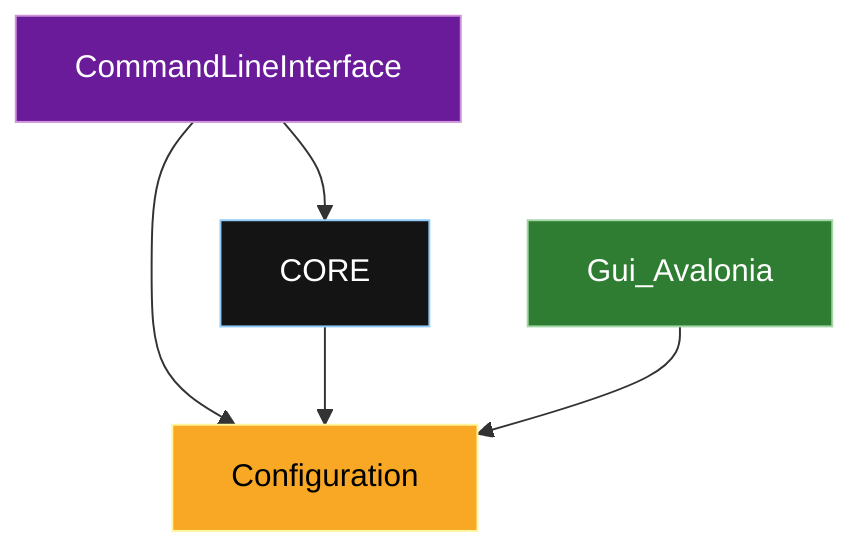

```mermaid
graph TD

    CommandLineInterface --> Configuration
    CommandLineInterface --> CORE

    CORE --> Configuration

    Gui_Avalonia --> Configuration

    classDef cls_yellow_custom_141414 fill:#141414,stroke:#90CAF9,color:#FFFFFF
    classDef cls_purple fill:#6A1B9A,stroke:#CE93D8,color:#FFFFFF
    classDef cls_yellow fill:#F9A825,stroke:#FFF59D,color:#000000
    classDef cls_green fill:#2E7D32,stroke:#A5D6A7,color:#FFFFFF

    class CORE cls_yellow_custom_141414
    class CommandLineInterface cls_purple
    class Configuration cls_yellow
    class Gui_Avalonia cls_green

```
